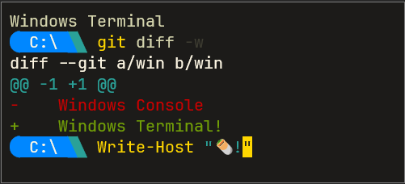
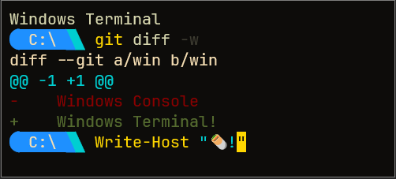

# Windows Terminal Color Schemes

This repository contains two custom color schemes for Windows Terminal:

- **Dark Brown Gold**


- **Deep Dark Brown Gold**



## How to Use

### Step 1: Download the JSON Files

Download the JSON files for the color schemes:

- [Dark Brown Gold](./dark_brown_gold.json)
- [Deep Dark Brown Gold](./deep_dark_brown_gold.json)

### Step 2: Add the Color Schemes to Your Windows Terminal Settings

1. **Open Windows Terminal Settings**:
   - Open Windows Terminal.
   - Click the down arrow in the tab bar.
   - Select "Settings".

2. **Edit the `settings.json` File**:
   - Click on "Open JSON file" to edit the settings.json file directly.

3. **Add the Color Schemes to the `"schemes"` Section**:
   - Copy the content of `dark_brown_gold.json` and `deep_dark_brown_gold.json` and paste it into the `"schemes"` array in `settings.json`.

Here is an example of how to add them:

```json
{
    "schemes": [
        {
            "background": "#1C1B19",
            "black": "#1C1B19",
            "blue": "#0087FF",
            "brightBlack": "#3E3D32",
            "brightBlue": "#5FAFFF",
            "brightCyan": "#6FB5A9",
            "brightGreen": "#A1B56C",
            "brightPurple": "#BAA58C",
            "brightRed": "#FF5F5F",
            "brightWhite": "#FDF6E3",
            "brightYellow": "#FFD700",
            "cursorColor": "#FFD700",
            "cyan": "#2AA198",
            "foreground": "#D7D7AF",
            "green": "#719E07",
            "name": "Dark Brown Gold",
            "purple": "#9E4E8A",
            "red": "#CC0000",
            "selectionBackground": "#3E3D32",
            "white": "#D7D7AF",
            "yellow": "#FFD700"
        },
        {
            "background": "#0D0C0A",
            "black": "#1C1B19",
            "blue": "#1E90FF",
            "brightBlack": "#3E3D32",
            "brightBlue": "#4682B4",
            "brightCyan": "#76EEC6",
            "brightGreen": "#8FBC8F",
            "brightPurple": "#B03060",
            "brightRed": "#CD5C5C",
            "brightWhite": "#F5DEB3",
            "brightYellow": "#FFD700",
            "cursorColor": "#FFD700",
            "cyan": "#00CED1",
            "foreground": "#D7D7AF",
            "green": "#556B2F",
            "name": "Deep Dark Brown Gold",
            "purple": "#9370DB",
            "red": "#8B0000",
            "selectionBackground": "#3E3D32",
            "white": "#D7D7AF",
            "yellow": "#FFD700"
        }
    ]
}
```
### Step 3:  Apply the Color Scheme to a Profile

To apply the color scheme to a specific profile, add or modify the "colorScheme" property in the desired profile. Here is an example:

```json
{
    "profiles": {
        "list": [
            {
                "guid": "{574e775e-4f2a-5b96-ac1e-a2962a402336}",
                "hidden": false,
                "name": "PowerShell",
                "colorScheme": "Dark Brown Gold"
            },
            {
                "guid": "{acbafd15-cbbb-5bb3-8a61-bed446ff4b83}",
                "hidden": false,
                "name": "Ubuntu",
                "colorScheme": "Deep Dark Brown Gold"
            }
        ]
    }
}
```

